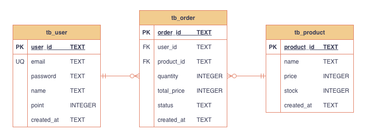

# Shop Backend

[](https://github.com/otu165/api-test-automation/actions/workflows/shop-backend.yml)

FastAPI 기반 쇼핑몰 백엔드 API 및 자동화 테스트 프로젝트

<br/>

---


## 프로젝트 구조

```text
shop-backend/
├── app/
│   ├── constants/       # 에러 코드, 상수
│   ├── core/            # DB 연결 및 SQL 관리
│   ├── exceptions/      # 공통 예외 처리
│   ├── repositories/    # DB 조회 및 저장 로직
│   ├── routers/         # API 라우터
│   ├── schemas/         # Request / Response 모델
│   ├── services/        # 비즈니스 로직 처리
│   └── utils/           # JWT, password hash 등 공통 유틸
│
├── tests/
│   ├── api/             # API 테스트 (auth, order, point)
│   ├── clients/         # 테스트용 API client
│   └── helpers/         # 테스트 공통 helper 함수
│
└── .github/
```

<br/>

---

## ERD

<p align="center">
  
</p>

<br/>

---

## 기술 스택

- Python 3.13
- FastAPI (REST API 구현)
- SQLite (DB)
- JWT (사용자 인증)
- Pytest (API 테스트)
- Pytest-cov (테스트 커버리지 측정)
- GitHub Actions (CI, 테스트 자동 실행)

<br/>

---

## 주요 기능

- 회원가입, 로그인, JWT 인증
- bcrypt 기반 비밀번호 해싱 및 입력 검증
- 계정 포인트 조회 및 충전
- 주문 생성, 취소, 상태(PAID, CANCELED) 관리
- 주문 취소 시 포인트 및 재고 복구
- 내 주문 목록, 상세 조회
- 사용자 권한 검증

<br/>

---

## 테스트 코드

- API 테스트 케이스 총 59개 작성
- 회원가입 / 로그인 API 성공 및 실패 검증
- 포인트 조회 / 충전 API 성공 및 실패 검증
- 주문 생성 / 취소 / 조회 API 성공 및 실패 검증
- JWT 인증 실패, 위조, 만료, Header 예외 케이스 검증
- pytest marker(auth, order, point, slow) 기반 테스트 분리
- 동시 주문 요청을 통한 재고 동시성 검증
- 테스트 커버리지 90%


<br/>

---

## CI / GitHub Actions

- main 브랜치 push 시 자동 테스트 실행 및 커버리지 측정
- HTML 테스트 리포트 및 커버리지 리포트 생성
- Artifact 다운로드 지원

<br/>

---

## 실행 방법

### 패키지 설치

```bash
pip install -r requirements.txt
```


### 서버 실행

```bash
uvicorn app.main:app --reload
```


### 테스트 실행
```bash
# 전체 테스트 실행
pytest

# 도메인별 테스트 실행
pytest -m auth
pytest -m order
pytest -m point
pytest -m slow

# 테스트 커버리지 측정
make coverage
```

<br/>

